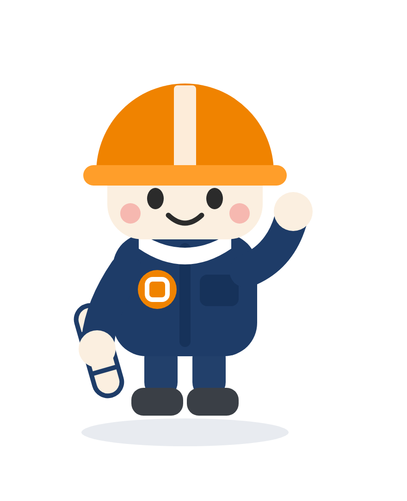

# 株式会社西中洲樋口建設 会社キャラクター 企画書＆生成プロンプト集

対象サイト: https://www.n-higuchi.jp/

このドキュメントだけで、
1. どんなキャラクターにするか（企画）
2. ChatGPT（GPT-5 / GPT Image・DALL·E）にそのまま貼れるプロンプト
3. 作ったあとの展開・注意点

まで完結するようにまとめています。**「5. そのまま貼れるプロンプト集」だけ読んでも使えます。**

---

## 1. 前提：会社の整理（プロンプトに入れる素材）

| 項目 | 内容 |
|---|---|
| 社名 | 株式会社西中洲樋口建設（にしなかす ひぐち けんせつ） |
| 所在地 | 福岡県福岡市中央区西中洲12-13 |
| 創業 | 1969年（昭和44年）／50年以上 |
| 事業 | 建築工事業・土木工事業／宅地建物取引業 |
| 一貫体制 | 設計プランニング → 不動産企画 → 施工 → アフター管理 |
| 手がける建物 | 公共施設・福祉施設・商業ビル・集合住宅・個人住宅・病院（高層ビル〜木造住宅） |
| 規模 | 従業員 約20名 |
| メッセージ | 「確かな施工と信頼」 |
| 社風 | 働き方改革（有休取得率向上・残業削減）、地域交流イベントへの参加 |

### キャラクターに背負わせたい価値（優先順）

1. **信頼・誠実** — 半世紀続いた地場ゼネコン。奇をてらわない安心感
2. **一貫して面倒を見る** — 建てて終わりではなく、設計前から引き渡し後まで伴走
3. **地域性（福岡・西中洲）** — 那珂川と博多の街に根ざしている
4. **幅の広さ** — ビルも木造住宅も、公共も福祉も病院も
5. **人の良さ・親しみやすさ** — 20名規模ならではの顔が見える距離感

---

## 2. 設計方針

- **BtoB＋BtoC の両方に効く必要がある。** 公共工事の入札資料の隣に置いても浮かない品位と、住宅を検討する家族に刺さる親しみやすさの両立。→ 「ゆるキャラ」に振り切らず、**きちんとした制服を着た、丸くて誠実なキャラクター**が正解。
- **社名を活かす。** 「樋口」の「樋（とい）」は雨水を受けて流す部材、「口」は建物のフレーム（開口部＝窓・入口）に見立てられる。ここに意味を持たせると、他社のマスコットと被らない。
- **ヘルメットは必須。** 建設会社のキャラクターで最も一瞬で伝わる記号。安全第一の姿勢の表明にもなる。
- **モノクロ・小サイズで潰れない形。** 名刺・封筒・現場の仮囲い・ヘルメットシール・作業着の刺繍で使う前提。シルエットだけで識別できること。

---

## 3. キャラクター案 3方向

### 案A（推奨）：**ヒグチくん** — 四角い顔＝「口」＝建物の開口部

- 顔が角丸の正方形。これが社名の「**口**」であり、同時に**窓・玄関＝人が出入りする開口部**を表す。
- オレンジのヘルメット、ネイビーの作業着。首に白いタオル。
- 手には図面の筒、または曲尺（さしがね）。
- **強み**：シルエットが四角＋ヘルメットのドームで、極小サイズでも識別できる。BtoBでも使える品位がある。汎用性が最も高い。

### 案B：**なかすけ** — 那珂川の水しぶきモチーフ

- 西中洲＝川に挟まれた中州。しずく／波形をベースにした青いキャラクター。
- 屋台の提灯や中洲の街並みを小物にできる、ご当地感が強い案。
- **強み**：地域密着イベント・地元向け広報で強い。**弱み**：建設会社だと一目で分からない。

### 案C：**トイちゃん** — 雨樋（あまどい）モチーフの守り手

- 「樋」そのものをキャラ化。雨から家族と建物を守る、傘のような存在。
- ストーリー性は最も高い。**弱み**：モチーフが渋く、説明なしでは伝わりにくい。

> **おすすめの持ち方**：案Aを正式マスコットにし、案Bを地域イベント限定のサブキャラにする二段構え。まずは案Aだけで十分です。

---

## 4. 推奨案（ヒグチくん）詳細スペック

| 項目 | 設定 |
|---|---|
| 名前 | ヒグチくん（別案：ヒグッチ／トイちゃん／ナカスケ） |
| 年齢設定 | 永遠の29歳。1969年生まれの「創業と同い年」設定にしてもよい |
| 性格 | まじめ・世話好き・約束を必ず守る。口数は多くないが現場では頼りになる。少し天然 |
| 口ぐせ | 「引き渡してからが、本当のお付き合いですけん」 |
| 特技 | 図面を見ただけで完成形が浮かぶ／どんな現場でも挨拶が一番大きい |
| 体型 | 3〜4頭身。手足は短く丸い。全体が角丸のかたまり |
| 顔 | 角丸の正方形。点目、小さな口角の上がった口、頬に薄い赤み。**鼻は描かない** |
| 装備 | オレンジのヘルメット（白いライン入り）、ネイビーの作業着、首に白タオル、安全靴 |
| 小物 | 図面の筒／曲尺／水平器／スコップ |
| カラー | ネイビー `#1E3C68`（信頼）／オレンジ `#F08300`（安全・現場）／生成り `#FBEFE0`／木の色 `#C8925A` |
| 線 | 均一な太さの輪郭線。フラットな塗り。グラデーション・写実的な影は使わない |
| NG | 汗・疲労・危険な動作の表現／ヘルメット未着用／怒った顔／過度に子どもっぽいデフォルメ |

---

## 5. そのまま貼れるプロンプト集（ChatGPT用）

### ① 企画・ネーミングを出させる（テキスト。まずこれ）

```
あなたは、地域に根ざした中小企業のブランディングを20年手がけてきたアートディレクター兼コピーライターです。
以下の会社の「会社キャラクター（マスコット）」を企画してください。

# 会社情報
- 社名：株式会社西中洲樋口建設（にしなかす ひぐち けんせつ）
- 所在地：福岡県福岡市中央区西中洲12-13
- 創業：1969年（昭和44年）、50年以上の歴史
- 事業：建築工事業・土木工事業／宅地建物取引業
- 特徴：設計プランニング → 不動産企画 → 施工 → アフター管理まで一貫して自社で行う
- 実績：公共施設・福祉施設・商業ビル・集合住宅・個人住宅・病院。高層ビルから木造住宅まで
- 規模：従業員約20名の地場ゼネコン
- メッセージ：「確かな施工と信頼」
- 社風：働き方改革に取り組む（有休取得率の向上・残業削減）、地域交流イベントにも参加

# 前提条件
- 用途：会社案内・名刺・封筒・現場の仮囲い・ヘルメットのシール・作業着の刺繍・採用サイト・LINEスタンプ
- 相手：発注者（自治体・法人）と、家を建てる一般の家族の両方
- したがって「ゆるキャラに振り切りすぎず、きちんと制服を着た、誠実で親しみやすい」バランスにすること
- 名刺サイズ・モノクロ・1cm角でも潰れない、シルエットで識別できる形にすること

# やってほしいこと
1. コンセプトの異なるキャラクター案を3つ出す。各案に必ず「社名・地域・事業のどれを、どう形にしたか」の理由を書く
2. 各案について、以下を表で整理する
   - 名前（読みがな付き。候補3つ）／モチーフ／体型・頭身／顔の作り／服装と装備／持ち物
   - カラーパレット（用途と16進カラーコード）／性格／口ぐせ／プロフィール設定
3. 3案を「一目で建設会社と分かるか」「BtoBで使えるか」「他社と被らないか」「小サイズでの視認性」の4軸で5点満点採点し、推奨案を1つ選んで理由を述べる
4. 推奨案について、画像生成AIにそのまま渡せる英語のプロンプトを1本書く

# 出力
日本語。見出しと表を使って、そのまま社内会議の資料として配れる形にすること。
```

### ② 画像を生成させる（GPT Image / DALL·E。推奨案Aをそのまま作る場合）

```
フラットなベクターイラスト風の、日本の建設会社のマスコットキャラクターを1体、全身で描いてください。

【キャラクター】
- 3.5頭身のデフォルメ。全身が丸みを帯びた、やさしい印象
- 顔は角丸の正方形（社名の「口」と、建物の窓・玄関を表している）
- 目は小さな黒い点、口は小さく口角が上がった笑顔、頬に薄いピンクの丸。鼻は描かない
- オレンジ色（#F08300）のヘルメットをかぶっている。白いラインが1本入っている
- 濃紺（#1E3C68）の作業着（長袖・襟付き）を着て、首に白いタオルをかけている
- 濃いグレーの安全靴
- 右手を上げて元気にあいさつしている。左手には丸めた図面の筒を持っている

【画風】
- フラットデザイン、均一な太さの輪郭線、ベタ塗り。グラデーション・質感・写実的な影は使わない
- 背景は白一色（無地）。ロゴや文字は一切入れない
- 正面向き、全身が収まる構図。キャラクターは1体だけ
- 印刷物やステッカーに使う前提の、清潔で信頼感のある印象

【避けること】
- 3D、水彩、アニメの厚塗り、リアルな人間、複数キャラ、文字、枠線、写真的な背景
- 怖い顔、疲れた顔、汗、危険な動作、ヘルメットをかぶっていない状態
```

**英語版（画像生成AIは英語のほうが安定しやすい）**

```
A flat vector mascot character for a Japanese construction company, full body, single character only.

Character: chibi proportions (3.5 heads tall), soft rounded body. The head is a rounded square shape.
Face: two small black dot eyes, a small upturned smile, soft pink circular blush on both cheeks, no nose.
Wearing an orange (#F08300) safety helmet with a single white stripe, a navy blue (#1E3C68) long-sleeved work jacket, a white towel around the neck, and dark grey safety boots.
Pose: right hand raised in a friendly greeting wave, left hand holding a rolled-up blueprint tube.

Style: flat design, clean uniform-weight outlines, solid fill colors, no gradients, no texture, no realistic shading. Pure white plain background. Front-facing, full body in frame. Clean, trustworthy, printable sticker-quality illustration.

Do not include: 3D rendering, watercolor, anime shading, realistic human, multiple characters, any text or letters, borders, photographic background, angry or tired expression, sweat, or a character without a helmet.
```

### ③ 表情・ポーズ差分を作らせる（キャラが決まったあと）

```
先ほど作ったキャラクター「ヒグチくん」の見た目・配色・画風を完全に維持したまま、
表情とポーズのバリエーションを9パターン、3×3のグリッドで1枚の画像にまとめてください。

1. 笑顔で右手を上げてあいさつ
2. 図面を広げて指をさし、説明している
3. 両手で丸を作って「OK」
4. 頭を下げて丁寧にお辞儀
5. 電話を耳に当てて対応している
6. ヘルメットに手を添えて安全確認
7. 親指を立ててサムズアップ
8. 困った顔で首をかしげる
9. 家の模型を大事そうに両手で抱えている

条件：全パターンで顔の作り・体型・配色・線の太さを揃えること。背景は白。文字は入れないこと。
```

### ④ 展開物のアイデアを出させる

```
会社キャラクター「ヒグチくん」を、株式会社西中洲樋口建設（福岡市中央区西中洲／創業1969年の地場ゼネコン）で
実際に運用していくための展開案を出してください。

以下の項目ごとに、具体的な使い方・サイズ感・注意点をセットで提案すること。
1. 営業まわり（名刺・会社案内・封筒・見積書の表紙）
2. 現場まわり（仮囲いのシート・工事看板・ヘルメットのシール・作業着のワッペン・近隣あいさつ状）
3. 採用（採用サイト・求人票・会社説明会の資料・インターン用ノベルティ）
4. 地域交流（イベントの着ぐるみ・のぼり・子ども向け配布物・現場見学会）
5. Web/SNS（サイトの案内役・工事進捗の投稿・LINE公式アカウント・LINEスタンプ40種の案）

さらに、社内でキャラクターを浸透させるための「運用ルール（使ってよい例・ダメな例）」を10項目にまとめてください。
```

### ⑤ ブラッシュアップさせる（生成物が微妙だったとき）

```
このキャラクター案を、プロのアートディレクターとして厳しく講評してください。
評価軸は次の5つ、それぞれ5点満点で採点し、点数の理由と「どう直せば1点上がるか」を具体的に書いてください。

1. 一目で建設会社のキャラクターだと分かるか
2. 自治体・法人向けの資料に載せても品位が保てるか
3. 名刺サイズ／モノクロ／1cm角でも形が潰れないか
4. 他の建設会社のマスコットと差別化できているか
5. 社名「樋口」・地域「福岡・西中洲」との結びつきが説明できるか

最後に、修正指示を反映した新しい画像生成プロンプトを英語で1本書いてください。
```

---

## 6. 使うときのコツ

- **①→②→⑤→③→④の順**に回すと精度が上がります。いきなり画像を出すより、①で言葉を固めてから②に渡すほうが失敗しません。
- **画像生成は「同じキャラを描き続けられない」のが弱点**です。気に入った1枚ができたら、その画像を毎回アップロードして「この画像のキャラを維持したまま」と指示するか、最終的にはイラストレーターに清書を頼むのが確実です。
- **カラーコードは必ず文字で指定**してください。「オレンジ」だけだと毎回色が変わります。
- **文字・ロゴは生成AIに描かせない**。日本語が崩れます。社名は後からIllustrator等で乗せてください。

## 7. 注意点

- 名前が決まったら、**商標検索（J-PlatPat）で同名・類似のマスコットがないか確認**してください。特に「ヒグチくん」は一般的な名前なので要確認です。
- 生成AI画像をそのまま商用ロゴ・商標登録に使うのはリスクがあります。**看板・名刺など実務で長く使うなら、生成物をラフ案としてイラストレーターに清書・権利譲渡してもらう**のが安全です。
- 着ぐるみ化まで視野に入れるなら、企画段階で「立体にしたときに自立するか」（頭の大きさ、手足の長さ）を確認しておくと後戻りがありません。

---

## 8. 同梱ファイル

| ファイル | 内容 |
|---|---|
| `higuchi-kun.svg` | 案A「ヒグチくん」のたたき台イラスト（ベクター） |
| `preview.html` | ブラウザで開いて確認するためのプレビュー |

> たたき台の見た目：
>
> 
