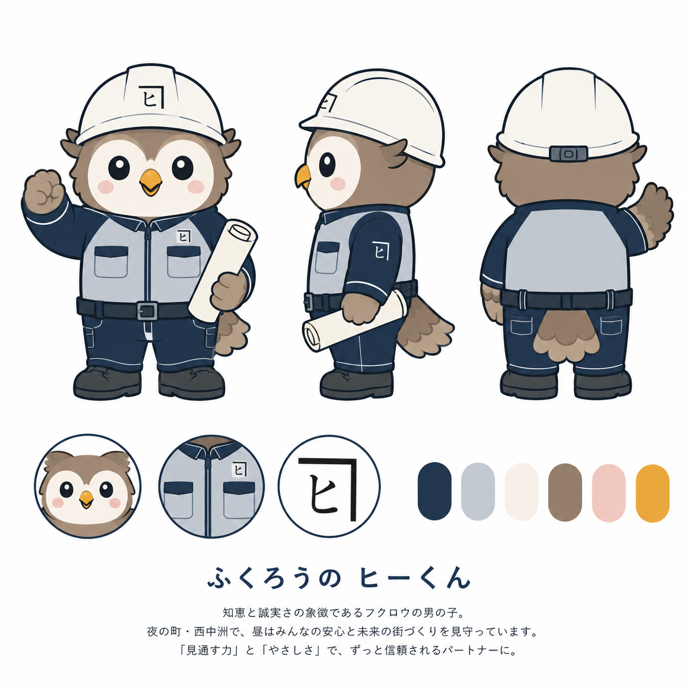

# ふくろうの ヒーくん — 株式会社西中洲樋口建設 公式キャラクター 設定書



採用決定案。以降のイラスト制作・グッズ展開は、すべてこの設定書を基準にしてください。

---

## 1. プロフィール

| 項目 | 設定 |
|---|---|
| 名前 | ふくろうの ヒーくん |
| 由来 | 「樋口」の**ヒ**／フクロウ＝**知恵と誠実さ**の象徴 |
| 種族・性別 | フクロウの男の子 |
| 職種 | 現場監督見習い（設計から引き渡し後まで、ぜんぶ見て回る係） |
| 性格 | まじめ・世話好き・約束を必ず守る。よく見ていて、よく気がつく |
| 特技 | 高いところから街全体を見渡せる／暗くても見える＝夜間や見えない部分の施工も手を抜かない |
| 口ぐせ | 「引き渡してからが、本当のお付き合いですけん」 |
| コンセプト文 | 知恵と誠実さの象徴であるフクロウの男の子。夜の街・西中洲で、昼も夜も、みんなの安心と未来の街づくりを見守っています。「見通す力」と「やさしさ」で、ずっと信頼されるパートナーに。 |

> **コンセプト文について**：キャラクターシート内の原文は「夜の町・西中洲で、昼はみんなの安心と…」となっており、少し意味が通りにくいので、上の表では「昼も夜も」に整えた版を正としています。原文のままでいく場合はそちらに差し替えてください。

### なぜこの案か（社内説明用）

- **社名**：「樋口」の頭文字「ヒ」がそのまま名前とヘルメットのマークになっている
- **地域**：西中洲＝夜の街。そこを昼も夜も見守る夜行性のフクロウ、という結びつきが自然
- **事業**：フクロウ＝知恵・先を見通す力。設計プランニングから施工・アフター管理まで一貫して「見通して、見守る」会社の姿勢と重なる
- **信頼**：フクロウは「不苦労」「福来朗」の縁起物。50年以上続く地場ゼネコンの安心感と相性がよい

---

## 2. デザイン仕様

### カラーパレット（キャラクターシートから抽出した実測値）

| 用途 | 色 | 16進 |
|---|---|---|
| 作業着・輪郭線・ロゴ | ネイビー | `#23374F` |
| 作業着の切り替え・ベルト | ライトグレー | `#C4CAD1` |
| ヘルメット・図面 | オフホワイト | `#F6F0E9` |
| 羽・体 | ブラウン | `#947F6B` |
| 頬 | ペールピンク | `#F0C8C0` |
| くちばし | イエロー | `#E9A73C` |
| 安全靴 | チャコール | `#484C4F` |
| 線画（最も濃い線） | ダークネイビー | `#091624` |

### 造形

| パーツ | 仕様 |
|---|---|
| 頭身 | 約2.5〜3頭身。頭が大きく、体は丸い |
| 顔 | まん丸。**白いフェイスディスク（顔の縁取り）**あり。目は大きな黒い丸に白いハイライト2点 |
| くちばし | 小さな黄色の三角。**口は描かない**（くちばしのみ） |
| 頬 | 薄いピンクの楕円 |
| 耳羽（うかん） | 頭の左右に小さく2本。**必ず描く**（フクロウらしさの決め手） |
| ヘルメット | オフホワイト。前面中央に「ヒ」のマーク。後頭部にアジャスター |
| 作業着 | ネイビー×ライトグレーの切り替え。ジップアップ、胸ポケット2つ、白いステッチ、腕にも「ヒ」 |
| ベルト | ネイビー×グレー、角型バックル |
| 足元 | チャコールの安全靴。足は羽と同じブラウン |
| 手 | 羽が手の形になっている。持ち物は丸めた図面 |
| 線 | 均一な太さのダークネイビーの輪郭線。フラット塗り＋ごく軽い陰影のみ |

### ロゴマーク

「ヒ」を、**開いた角（かど）＝建物のフレーム**で囲んだマーク。
ヘルメット・作業着・名刺・封筒で、キャラクターと切り離して単体でも使えます。

### NG（やってはいけない表現）

- ヘルメットをかぶっていない状態で現場に立たせる
- 耳羽を省略する／くちばしに口を足す／目を細くする
- 怒った顔、疲れた顔、汗、危険な動作（高所での身乗り出し、脚立の天板に立つ等）
- 色の勝手な変更（特にネイビーとブラウン）、グラデーションや3D化
- 特定の宗教・政党・他社商品との組み合わせ

---

## 3. ChatGPTで描き続けるためのプロンプト

> 画像生成AIは放っておくと毎回違うキャラを描きます。**必ず上のキャラクターシート画像を一緒にアップロードし**、そのうえで以下を貼ってください。

### ① 表情・ポーズ差分（9パターン一括）

```
アップロードした画像のキャラクター「ふくろうの ヒーくん」の見た目・配色・画風を完全に維持したまま、
表情とポーズのバリエーションを9パターン、3×3のグリッドで1枚の画像にまとめてください。

1. 笑顔で右の翼を上げてあいさつ
2. 図面を広げて翼で指し示し、説明している
3. 両翼で丸を作って「OK」
4. 頭を下げて丁寧にお辞儀
5. 翼で電話を持って対応している
6. ヘルメットに翼を添えて安全確認
7. サムズアップ（翼で親指を立てる）
8. 困った顔で首をかしげる
9. 家の模型を大事そうに両翼で抱えている

【絶対に維持すること】
- ブラウン(#947F6B)の体、白いフェイスディスク、頭の左右の耳羽2本
- 黄色(#E9A73C)の小さな三角のくちばし（口は描かない）、ピンク(#F0C8C0)の頬
- オフホワイト(#F6F0E9)のヘルメット（前面に「ヒ」マーク）
- ネイビー(#23374F)×ライトグレー(#C4CAD1)の作業着、チャコールの安全靴
- 均一な太さのダークネイビーの輪郭線、フラットな塗り、2.5〜3頭身

背景は白一色。文字は入れないこと。9パターンすべてで顔の作り・体型・線の太さを揃えること。
```

### ② 季節・イベント差分

```
アップロードした画像のキャラクター「ふくろうの ヒーくん」の見た目・配色・画風を完全に維持したまま、
以下のシーン差分を描いてください。作業着とヘルメットは基本そのまま、小物だけで季節感を出すこと。

- 上棟式（御幣を持っている）
- 地鎮祭（鍬入れの鍬を持っている）
- 現場見学会（子どもサイズのヘルメットを差し出している）
- 年末年始のあいさつ（門松と一緒に、深くお辞儀）
- 夏の安全大会（水筒を持って、熱中症対策を呼びかけている）

背景は白一色、文字は入れないこと。
```

### ③ 単体アイコン／ロゴ用

```
アップロードした画像のキャラクター「ふくろうの ヒーくん」の顔だけを、円形に切り取ったアイコンとして描いてください。
正面向き、笑顔、ヘルメットの「ヒ」マークが見える構図。
背景はネイビー(#23374F)一色、キャラクターの周囲に白い細い円形の枠線を1本。
文字は入れないこと。SNSのプロフィール画像に使います。
```

### ④ 英語マスタープロンプト（新規に描き起こす場合）

```
A flat vector mascot character: a cute male owl construction worker, full body, single character only.

Body: chibi proportions (about 2.5 heads tall), round soft body, brown feathers (#947F6B), a white facial disc around the face, two small ear tufts on top of the head, large round black eyes with two white highlights each, a small yellow triangular beak (#E9A73C, no mouth line), pale pink oval blush (#F0C8C0).
Outfit: off-white (#F6F0E9) safety helmet with a small Japanese katakana "ヒ" mark on the front; a navy (#23374F) and light grey (#C4CAD1) zip-up work jacket with white stitching and two chest pockets; a navy and grey belt with a square buckle; charcoal (#484C4F) safety boots.
Pose: right wing raised in a friendly greeting wave, left wing holding a rolled-up blueprint.

Style: flat design with clean uniform-weight dark navy outlines, solid fill colors, minimal soft shading, no gradients, no 3D. Pure white plain background. Front-facing, full body in frame. Clean, trustworthy, printable sticker-quality illustration.

Do not include: 3D rendering, realistic feathers, photographic background, multiple characters, any text, angry or tired expression, sweat, or a version without the helmet.
```

---

## 4. 展開プラン

| 場面 | 使い方 | サイズの目安・注意 |
|---|---|---|
| 名刺 | 裏面の隅に全身、または表面にロゴマークのみ | 全身は高さ15mm以上。それ以下ならロゴマークに切り替える |
| 会社案内・見積書 | 表紙にあいさつポーズ、各章の扉に表情差分 | 金額が並ぶページには置かない（軽く見える） |
| 封筒・便箋 | 差出人欄の横に小さく | 1色（ネイビー）版を用意しておくと印刷が安い |
| 現場の仮囲い | 大きく全身＋「安全第一」「ご迷惑をおかけします」 | 屋外・退色するのでUVラミネート必須 |
| 工事看板・近隣あいさつ状 | お辞儀ポーズ | あいさつ状は文章を主役に、キャラは添える程度 |
| ヘルメットシール | 顔アイコン（円形）直径30〜40mm | 極小になるので**顔だけ版**を使う。全身は潰れる |
| 作業着のワッペン | ロゴマーク or 顔アイコン | 刺繍は色数が増えるとコストが上がる。3色以内の簡略版を作る |
| 採用サイト・求人票 | 案内役として各セクションに配置 | 若手向けに効く。社員写真と並べると温度感が出る |
| 現場見学会・地域イベント | のぼり、子ども向け配布物（ぬりえ・シール） | ぬりえ用の**線画のみ版**を作っておくと使い回せる |
| SNS・LINE公式 | 工事進捗の投稿、アイコン、スタンプ | スタンプは40種。あいさつ・返事・お礼・謝罪を厚めに |

### 優先してつくる素材（この順番）

1. **顔アイコン（円形）** — 最も使い回しが効く
2. **ロゴマーク単体（ネイビー1色・白抜き）** — 印刷物の全てに効く
3. **あいさつ／お辞儀の全身2ポーズ** — 営業資料はほぼこれで足りる
4. **表情差分9パターン** — Web・SNS用
5. **線画のみ版** — 地域イベント・ぬりえ用

---

## 5. 運用ルール（社内配布用）

1. キャラクターの色は変更しない。特にネイビー `#23374F` とブラウン `#947F6B`
2. 縦横比を変えない（引き伸ばし・つぶし禁止）
3. 回転させない。傾けた配置をしない
4. 影・光彩・立体加工などのエフェクトを足さない
5. 高さ15mm未満で全身を使わない。小さい場所は顔アイコンかロゴマークを使う
6. ヘルメットを外した姿を、現場・工事関連の絵で使わない
7. 危険な動作・法令違反にあたる作業姿勢を描かない
8. 謝罪・事故・トラブルに関する文書には使わない
9. 他社ロゴ・他キャラクターと並べる場合は事前に確認を取る
10. 新しいポーズや差分を作ったら、必ずこのフォルダに追加して全社で共有する

---

## 6. これからやること（実務チェックリスト）

- [ ] **商標検索**：J-PlatPatで「ヒーくん」「ヒーくん＋建設」の同名・類似を確認（一般的な名前なので要確認）
- [ ] **清書と権利処理**：生成AIの絵をそのまま看板・名刺の本番に使うのはリスクがあるため、この画像をラフ案としてイラストレーターに清書とベクターデータ化を依頼し、**著作権の譲渡（または独占的利用許諾）を契約書で明記**する
- [ ] **データ整備**：AI/EPS（ベクター）、PNG透過（大中小）、1色版、線画版を一式そろえる
- [ ] **社内お披露目**：名前の由来と運用ルールをA4一枚にまとめて配布
- [ ] （将来）着ぐるみ化を検討する場合は、頭の大きさと足の長さで自立するかを企画段階で確認

---

## 7. ファイル

| ファイル | 内容 |
|---|---|
| `assets/hii-kun-charactersheet.png` | 採用版キャラクターシート（三面図・顔・作業着ディテール・ロゴ・配色） |
| `preview.html` | ブラウザで開いて、モノクロ・小サイズでの見え方を確認するためのページ |
